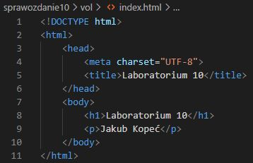
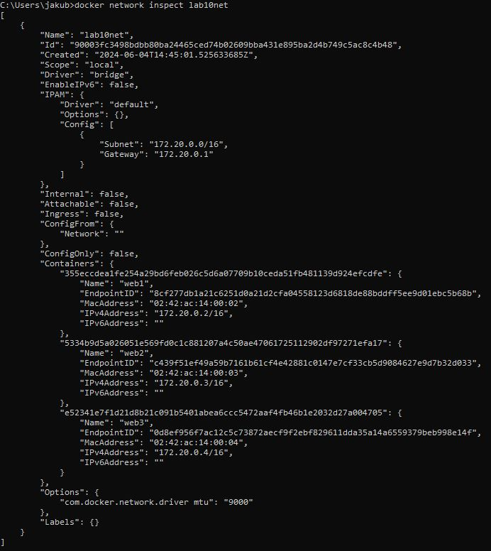

# docker-lab-10-networks-volumes
Example usage of networks and volumes in Docker.

## Table of Contents

- [Requirements](#requirements)
- [Directories And Network](#directories-and-network)
- [Images](#images)
- [Results](#results)

## Requirements

For Linux and Windows systems Docker or Docker Desktop must be installed and running.

For Windows systems WSL must be installed.

## Directories And Network

Example for Windows:

Prepare the "vol" directory or use one from this repo:

```cmd
mkdir vol
```

Results:


Prepare the "index.html" file or use one from this repo:

```cmd
cd vol
```

```cmd
echo. > index.html
```

Results:


Put some HTML inside:



Prepare the "lab10" directory in the home directory and directories for logs in it:

```cmd
cd %homedrive%%homepath%
```

```cmd
mkdir lab10
```

```cmd
cd lab10
```

```cmd
mkdir web1logs web2logs web3logs
```

Results:


Create a network in Docker for containers:

```cmd
docker network create -o "com.docker.network.driver mtu"=9000 lab10net
```

Results:


## Images

Create three images: web1, web2, and web3. Mount volumes for HTML site for nginx server (each server use the same volume with HTML site) and for servers logs (each server use separate volumes for logs). Make each volume type bind, and for volume with the HTML site, make it read-only. Connect images to the created network and make them accessible from the host system using proper port mapping:

```cmd
docker run -d --name web1 --mount type=bind,source=C:\Users\jakub\Desktop\studia_year_3\sem6\programowanie_aplikacji_w_chmurze_obliczeniowej\laboratorium\lab10\sprawozdanie10\vol,target=/usr/share/nginx/html,readonly --mount type=bind,source=C:\Users\jakub\lab10\web1logs,target=/var/log/nginx --network lab10net -p 9991:80 nginx:latest
```

```cmd
docker run -d --name web2 --mount type=bind,source=C:\Users\jakub\Desktop\studia_year_3\sem6\programowanie_aplikacji_w_chmurze_obliczeniowej\laboratorium\lab10\sprawozdanie10\vol,target=/usr/share/nginx/html,readonly --mount type=bind,source=C:\Users\jakub\lab10\web2logs,target=/var/log/nginx --network lab10net -p 9992:80 nginx:latest
```

```cmd
docker run -d --name web3 --mount type=bind,source=C:\Users\jakub\Desktop\studia_year_3\sem6\programowanie_aplikacji_w_chmurze_obliczeniowej\laboratorium\lab10\sprawozdanie10\vol,target=/usr/share/nginx/html,readonly --mount type=bind,source=C:\Users\jakub\lab10\web3logs,target=/var/log/nginx --network lab10net -p 9993:80 nginx:latest
```

Results:


## Results

Containers connected to the network (Containers node):

```cmd
docker network inspect lab10net
```

Result:



Mounts connected to the containers (Mounts node):

```cmd
docker container inspect web1 | jq ".[].Mounts"
```

```cmd
docker container inspect web2 | jq ".[].Mounts"
```

```cmd
docker container inspect web3 | jq ".[].Mounts"
```

Results:


Nginx servers with HTML sites from volume accessible from the host system on different ports for each container:


Changes made in the HTML file from volume folder on the host system are visible on all servers (no need to shutdown the container to make changes).

Logs from servers appear in separate volume directories on the host system:

```cmd
cd %homedrive%%homepath%\lab10
```

```cmd
dir web1logs
```

```cmd
dir web2logs
```

```cmd
dir web3logs
```

Results:


Content of logs for the chosen server (web1):

```cmd
cd web1logs
```

```cmd
more access.log
```

```cmd
more error.log
```

Results:


